# Eghtanem App 📱✨


[](https://flutter.dev/)
[](https://dart.dev/)
[](LICENSE)

## 📑 Table of Contents

- [Overview](#-overview)
- [Features](#-features)
- [Screenshots](#-screenshots)
- [Architecture](#-architecture)
- [Installation](#-installation)
- [Configuration](#-configuration)
- [Usage](#-usage)
- [Video Player Guide](#-video-player-guide)
- [Contributing](#-contributing)
- [License](#-license)

## 🌟 Overview

Eghtanem is a comprehensive Islamic app designed to provide easy access to Islamic resources including Quran, Hadith, Tafseer, Dhikr (Remembrances), and educational Islamic videos. The app aims to help Muslims connect with their faith through modern, user-friendly interfaces.

## ✨ Features

- **Quran:** Read and listen to Quranic recitations with multiple reciters
- **Hadith:** Browse through authentic hadiths with search functionality
- **Tafseer:** Access comprehensive Quran interpretations
- **Dhikr/Azkar:** Daily remembrances with counter functionality
- **Islamic Videos:** Educational content with social features
- **User Authentication:** Secure login and registration
- **Offline Mode:** Access core features without internet
- **Multi-language Support:** Arabic interface with partial English support
- **Bookmarks & Favorites:** Save your preferred content

## 📱 Screenshots

<table>
  <tr>
    <td>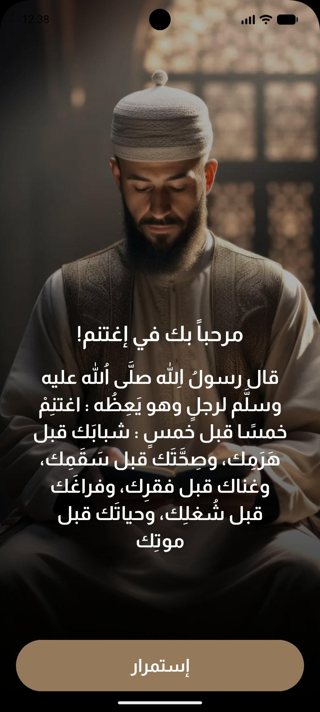</td>
    <td>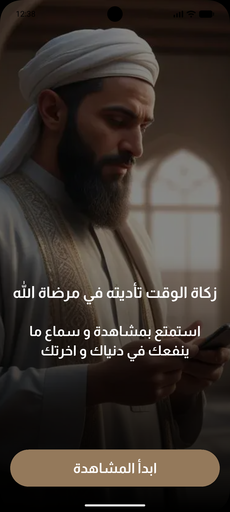</td>
    <td>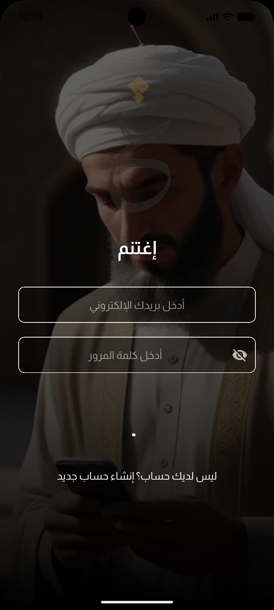</td>
  </tr>
  <tr>
    <td>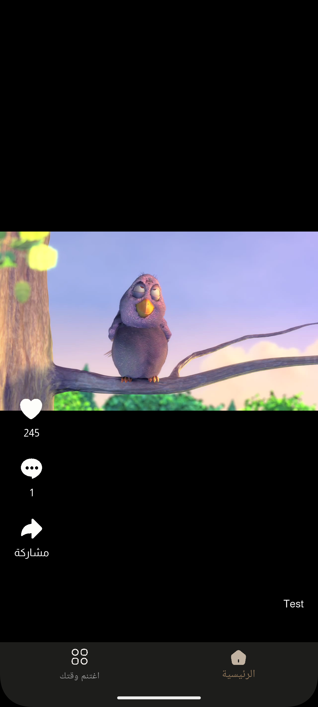</td>
    <td>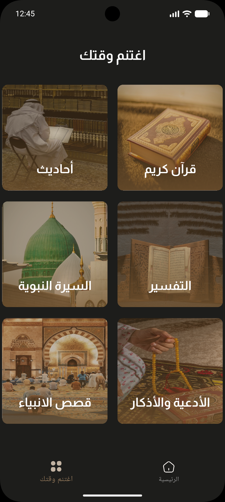</td>
    <td>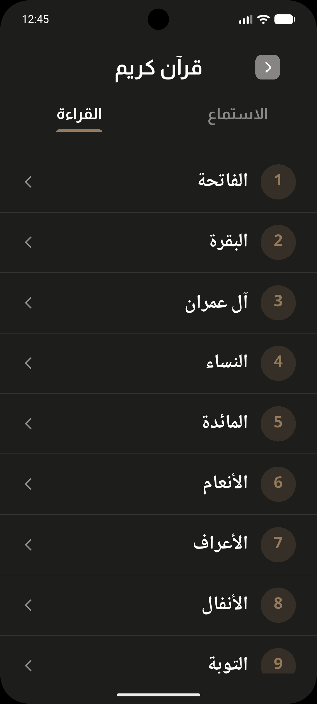</td>
  </tr>
  <tr>
    <td>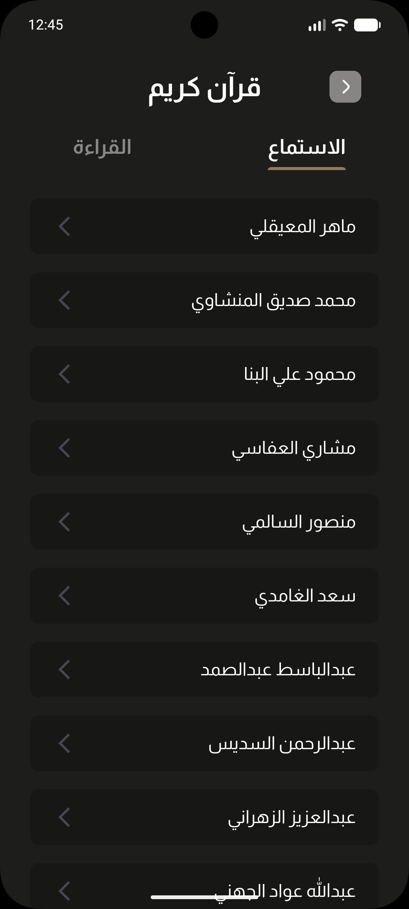</td>
    <td>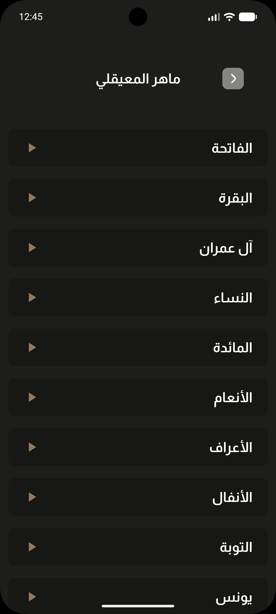</td>
    <td>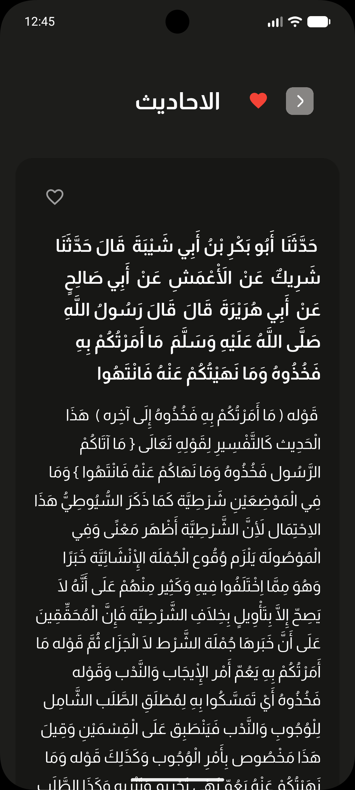</td>
  </tr>
  <tr>
    <td>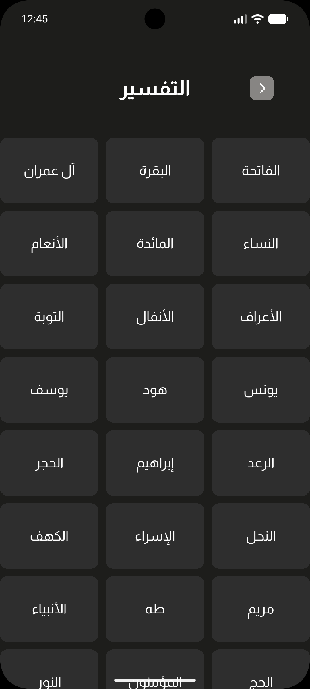</td>
    <td>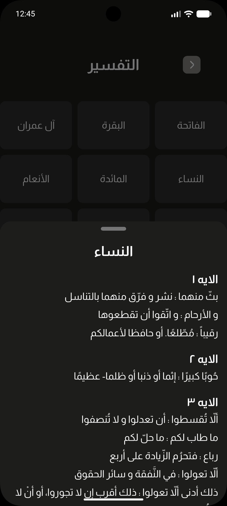</td>
    <td>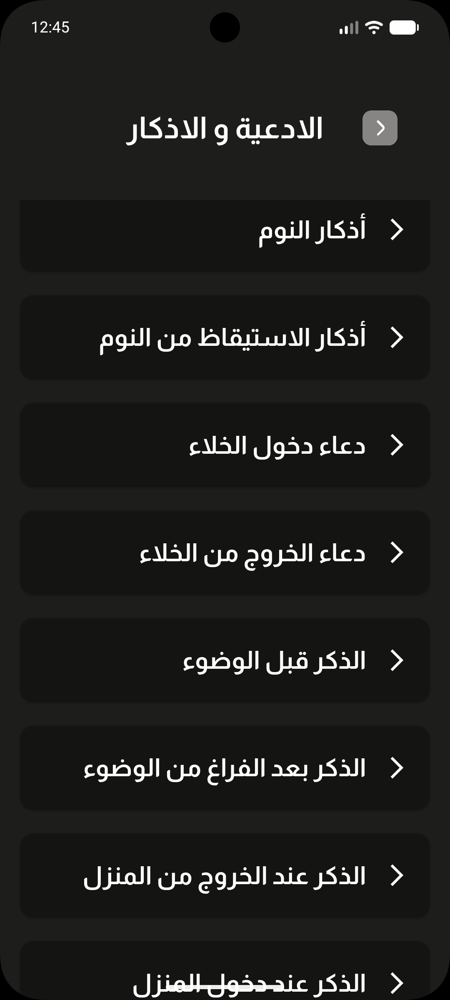</td>
    
  </tr>
</table>

## 🏗 Architecture

Eghtanem App follows a clean architecture approach with BLoC pattern (using Cubit) for state management:

```
lib/
├── core/                      # Core functionality and utilities
│   ├── constants/             # App constants and configurations 
│   ├── errors/                # Error handling and exceptions
│   ├── network/               # Network services and interceptors
│   ├── theme/                 # App theme, colors, and text styles
│   └── utilities/             # Helper functions and utilities
├── features/                  # Feature modules
│   ├── auth/                  # Authentication feature
│   ├── categories/            # App categories
│   ├── dhikr/                 # Dhikr/remembrances feature
│   ├── hadith/                # Hadith feature 
│   ├── home/                  # Home screen and navigation
│   ├── quran/                 # Quran feature
│   ├── tafseer/               # Tafseer feature
│   └── video/                 # Video player feature
├── models/                    # Shared data models
├── views/                     # Shared or common view components
│   └── onboarding/            # Onboarding screens
└── widgets/                   # Reusable UI components
```

### Key Packages:

- **State Management**: `flutter_bloc` (Cubit pattern)
- **Dependency Injection**: `get_it`
- **API Handling**: `dio`, `retrofit`
- **Local Storage**: `shared_preferences`, `flutter_secure_storage`
- **UI Components**: `flutter_screenutil`, `flutter_svg`
- **Media**: `video_player`, `audio_players`

## 🚀 Installation

### Prerequisites

- Flutter SDK (3.16.0 or later)
- Dart SDK (3.2.0 or later)
- Android Studio / VS Code
- Git

### Steps

1. Clone the repository:

```bash
git clone https://github.com/mahmoudasal/Eghtanem_App.git
cd Eghtanem_App
```

2. Install dependencies:

```bash
flutter pub get
```

3. Run code generation (for JSON serialization, Retrofit, etc.):

```bash
flutter pub run build_runner build --delete-conflicting-outputs
```

4. Run the app:

```bash
flutter run
```

## ⚙️ Configuration

### Environment Variables

Create a `.env` file in the `assets` folder:

```
API_BASE_URL=https://your-api-base-url.com/api
STORAGE_KEY=your-secure-storage-key
```

### Authentication

For development and testing, you can use the default credentials:

- Email: `admin@app.com`
- Password: `123456`

These default credentials work in offline mode without requiring an API connection.

## 🔍 Usage

### Login

The app includes both online and offline login capabilities. For development and testing, you can use the default credentials mentioned above.

### Navigation

The app features a bottom navigation bar with the following sections:
- Home/Categories
- Quran
- Hadith
- Dhikr
- Videos

### Offline Mode

Most features work offline using pre-loaded data. The app will automatically sync when internet connectivity is restored.

## 📹 Video Player Guide

The video player in Eghtanem App supports both network and local asset videos.

### Changing Videos

To modify the videos displayed in the app:

1. **Edit JSON Data**: Update `assets/data/videos.json` with your video URLs:

```json
[
  {
    "id": 1,
    "title": "Your Video Title",
    "description": "Description of your video",
    "video": "https://example.com/videos/your-video.mp4",
    "thumbnail": "https://example.com/thumbnails/your-thumbnail.jpg",
    "likes_count": 0,
    "comments": []
  }
]
```

2. **Using Local Videos**:
   - Add videos to `assets/videos/` folder
   - Update the JSON to use asset paths: `"video": "assets/videos/your-video.mp4"`
   - Update `pubspec.yaml` to include the assets folder

3. **Video Format Recommendations**:
   - Format: MP4 with H.264 encoding
   - Resolution: 720p (1280x720) or 1080p (1920x1080)
   - Aspect Ratio: 16:9 (landscape) or 9:16 (portrait)
   - Bitrate: 2-5 Mbps for optimal quality/size balance

### Video Player Controls

- **Tap**: Play/Pause
- **Long Press**: Enable 2x speed (while pressed)
- **Interactions**: Like, Comment, Share

## 👥 Contributing

Contributions are welcome! Please follow these steps:

1. Fork the repository
2. Create a new branch: `git checkout -b feature/your-feature-name`
3. Make your changes and commit them: `git commit -m 'Add some feature'`
4. Push to your branch: `git push origin feature/your-feature-name`
5. Open a pull request

Please ensure your code adheres to our coding standards and includes appropriate tests.

## 📄 License

This project is licensed under the MIT License - see the [LICENSE](LICENSE) file for details.

---

<p align="center">Made with ❤️ for a better Islamic digital experience</p>
